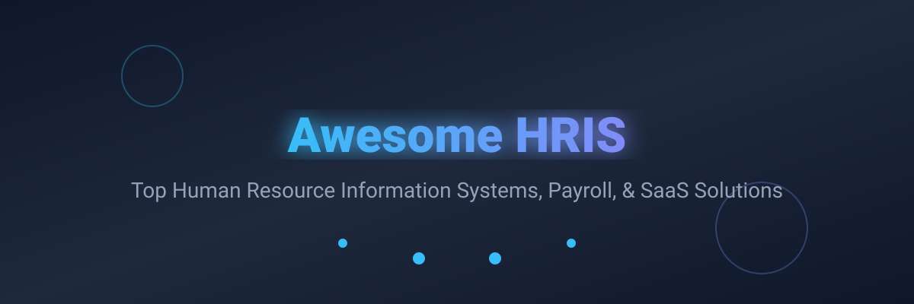

# Awesome Human Resources Information System (HRIS) 🚀

  

  
  
  

## 🌟 Top HRIS Tools Ecosystem & Best Human Resource Information Systems
**Curated List of SaaS Products & Open-Source GitHub Projects for People Ops**

*Focused on Human Resource Information Systems, Employee Records, Payroll Software, Leave & Attendance, Onboarding, Benefits & People Operations*

**Last updated: August 2026**

This repository tracks notable **SaaS platforms** and **open-source projects** for **HRIS (Human Resource Information Systems)**. These top SaaS HR tools serve as the system of record for employee data and typically cover core HR, onboarding, time-off, attendance, payroll (or payroll integrations), benefits administration, performance, and employee self-service.

**Open-source emphasis**: Core HRIS functionality has several mature open-source options. The section below prioritizes actively maintained, self-hostable platforms that organizations can run without per-employee licensing fees while retaining full control over sensitive employee data.

Contributions welcome! Open a PR to add/update entries. Keep descriptions factual and link to official sites / GitHub repos.

## 📋 Table of Contents
- [SaaS/Hosted Platforms ☁️](#saas-hosted-platforms-☁️)
- [Open-Source GitHub Projects 🛠️](#open-source-github-projects-🛠️)
- [How to Contribute 🤝](#how-to-contribute-🤝)
- [Disclaimer ⚠️](#disclaimer-⚠️)
- [Star History ⭐](#star-history-⭐)

## SaaS/Hosted Platforms ☁️

| Platform | Description | Company Size (Valuation/Revenue) | Pricing (Starting Tier) | Free Tier / Trial Limits |
| :--- | :--- | :--- | :--- | :--- |
| **[Oracle Cloud HCM](https://www.oracle.com/human-capital-management/)** | Enterprise HCM suite frequently evaluated alongside Workday. | ~$350B Valuation | ~$13/employee/month (estimated) | No free tier or trial (Demo available) |
| **[SAP SuccessFactors](https://www.sap.com/products/hcm.html)** | Enterprise HCM suite frequently evaluated alongside Workday. | ~$200B Valuation | ~$100,000/year minimum (estimated) | 30-day free trial limit (Sample data only) |
| **[Workday](https://www.workday.com/)** | Enterprise-grade HCM and financials platform covering HR, payroll, talent, learning, and planning. | ~$80B Valuation | ~$100/employee/year (estimated) | No free tier or trial (Demo available) |
| **[UKG](https://www.ukg.com/)** | Enterprise HCM suite frequently evaluated alongside Workday. | ~$22B Valuation | ~$20/employee/month (estimated) | No free tier or trial (Demo available) |
| **[Deel](https://www.deel.com/)** | Global payroll, EOR, contractor management, and HR platform designed for distributed teams. | ~$12B Valuation | $49/contractor/month | Free tier for Deel HR (Up to 200 users limit) |
| **[Rippling](https://www.rippling.com/)** | Unified platform combining HR, payroll, IT (device & app management), and spend. | ~$11.2B Valuation | $8/user/month | 14-day free trial limit (IT management only) |
| **[Gusto](https://gusto.com/)** | US-focused payroll, benefits, and HR platform popular with small businesses. | ~$9.5B Valuation | $35/month + $6/contractor/month | Free account setup limit (No payroll runs) |
| **[Personio](https://www.personio.com/)** | European HRIS and payroll platform focused on SMBs and mid-market companies. | ~$8.5B Valuation | ~$3/employee/month (estimated) | 14-day free trial limit |
| **[Paylocity](https://www.paylocity.com/)** | US-based HCM platform offering payroll, HR, benefits, and talent management with strong analytics. | ~$8B Valuation | ~$22/employee/month (estimated) | No free tier or trial (Demo available) |
| **[Remote](https://remote.com/)** | Global employment and HR platform specializing in compliant international hiring, payroll, and benefits. | ~$3B Valuation | $29/contractor/month | Free tier for Remote HRIS (Unlimited users limit) |
| **[HiBob](https://www.hibob.com/)** | Modern people platform focused on culture, employee experience, and scalable HR operations. | ~$2.7B Valuation | ~$16/employee/month (estimated) | No free tier or trial (Demo available) |
| **[BambooHR](https://www.bamboohr.com/)** | Popular mid-market and SMB HRIS known for clean UX, employee records, onboarding, time-off, and reporting. | ~$1B+ Valuation | $10/employee/month | 7-day free trial limit |
| **[Factorial](https://factorialhr.com/)** | All-in-one HR platform popular in Europe and growing markets. | ~$1B Valuation | ~$8/user/month | 14-day free trial limit |

## Open-Source GitHub Projects 🛠️

- **[Odoo HR](https://github.com/odoo/odoo)**   
  Human resources modules within the Odoo open-source ERP suite. Includes employees, time off, recruitment, appraisals, expenses, and related features. Highly extensible via the Odoo Community Association (OCA) HR repositories.
- **[ERPNext](https://github.com/frappe/erpnext)**   
  Full-featured open-source ERP with a robust HR and payroll module, built on the Frappe framework.
- **[Dolibarr](https://github.com/Dolibarr/dolibarr)**   
  Open-source ERP and CRM software that includes a comprehensive suite of HR management modules.
- **[OrangeHRM](https://github.com/orangehrm/orangehrm)**   
  Long-standing open-source HR management system with modules for employee management, leave, time, recruitment, performance, and more. Widely recognized and battle-tested for core HRIS needs.
- **[Frappe HR](https://github.com/frappe/hrms)**   
  Modern, actively developed open-source HR and Payroll software built on the Frappe framework. Covers employee lifecycle, leave & attendance, shifts, expense claims, recruitment, performance, payroll, taxation, and analytics. One of the strongest full-featured open HRIS options, especially when paired with ERPNext.
- **[IceHrm](https://github.com/icehrm/icehrm)**   
  Modern open-source HR management platform with a clean interface, employee self-service, leave, attendance, and related modules. Actively maintained and suitable for SMBs seeking a contemporary self-hosted option.
- **[Sentrifugo](https://github.com/sapplica/sentrifugo)**   
  Open-source HRMS focused on appraisals, employee self-service, and core HR processes.
- **[TimeTrex Community](https://github.com/timetrex/timetrex)**   
  Open-source time and attendance / workforce management system that can serve as a strong component of an HRIS stack, with payroll capabilities in higher editions.

### Additional Strong Open-Source Options 🧩
- Custom employee portals and self-service frontends built on open frameworks.
- Open-source ATS / recruiting tools (e.g., OpenCATS) that complement core HRIS systems.
- Payroll calculation engines and tax libraries for specific jurisdictions (often paired with Frappe HR or Odoo).
- Integration connectors for SSO, accounting, and benefits providers.
- Lightweight Django or other framework-based leave and attendance applications for very small teams.

**Frameworks for building custom systems**: Organizations already running **ERPNext** or the Frappe stack typically adopt **Frappe HR**. Those wanting a standalone classic HRIS often start with **OrangeHRM**. Teams invested in the Odoo ecosystem use **Odoo HR + OCA modules**. Payroll remains the biggest gap in pure open-source for many countries — most deployments integrate a local payroll provider or use paid modules for full compliance.

## How to Contribute 🤝
1. Fork the repo.
2. Add/edit entries in `README.md` (follow existing format).
3. Include: name, link, 1–2 sentence description, and whether it's SaaS or open-source.
4. Submit PR with a short explanation.

⭐ Star the repo if you find it useful!

## Disclaimer ⚠️
- This is a **community-curated** list — not exhaustive and not an endorsement.
- HRIS platforms should be evaluated for core employee data management, leave/attendance accuracy, payroll compliance (especially multi-country), reporting, employee self-service experience, integrations, data residency/security, and total cost of ownership (including self-hosting effort).
- Open-source HRIS solutions give full data ownership and eliminate per-employee fees but require technical resources for deployment, security hardening, backups, upgrades, and often a separate payroll solution for full statutory compliance.

## Star History ⭐

---
**Made for People Ops leaders, HR teams, and organizations that want control over employee data without perpetual per-seat lock-in.** 🌍💼
Let's make core HR, employee records, and people operations more open, private, and affordable.
